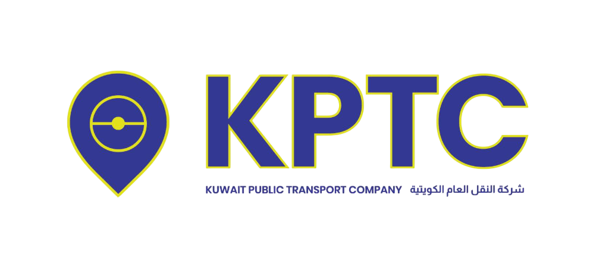

# KPTC Dashboard React



A comprehensive React-based dashboard application for Kuwait Public Transport Company's vehicle maintenance and job order management system. The application features a bilingual interface (English and Arabic), interactive visualizations, and complete job order workflow management.

## Features

- **Bilingual Support**: Complete English and Arabic interface with RTL layout support
- **Interactive Dashboard**: Real-time statistics and performance metrics
- **Job Order Management**: Track maintenance requests from reception to delivery
- **Data Visualization**: Charts and graphs for performance analysis
- **Responsive Design**: Works on desktop and mobile devices

## Demo

Live demo available at: [https://kptc-dashboard-react.vercel.app](https://kptc-dashboard-react.vercel.app)

## Screenshots


## Technologies Used

- React.js
- Vite
- Chart.js (with react-chartjs-2)
- Bootstrap Icons
- Context API for state management
- CSS3 with RTL support

## Getting Started

### Prerequisites

- Node.js (v14.0.0 or later)
- npm (v6.0.0 or later)

### Installation

1. Clone the repository:
   ```bash
   git clone https://github.com/ghousekw/KPTC_Dashboard_React.git
   cd KPTC_Dashboard_React
   ```

2. Install dependencies:
   ```bash
   npm install
   ```

3. Start the development server:
   ```bash
   npm run dev
   ```

4. Open your browser and navigate to:
   ```bash
   http://localhost:5173/
   ```

### Building for Production

```bash
npm run build
```

The compiled files will be generated in the `dist` directory.

## Project Structure

```
kptc-vite/
├── public/
│   ├── assets/
│   │   └── images/
│   └── vite.svg
├── src/
│   ├── components/
│   │   ├── charts/
│   │   │   ├── DetailedStats.jsx
│   │   │   ├── ExecutiveSummaryChart.jsx
│   │   │   ├── JobCardFlow.jsx
│   │   │   ├── ...
│   │   └── dashboard/
│   │       ├── KPTCDashboard.jsx
│   │       └── KPTCDashboard.css
│   ├── context/
│   │   └── LanguageContext.jsx
│   ├── App.jsx
│   ├── App.css
│   └── main.jsx
├── index.html
├── package.json
└── vite.config.js
```

## Key Components

- **KPTCDashboard**: Main dashboard component with stats and charts
- **ExecutiveSummaryChart**: Overview for management with KPIs
- **TechnicianJobsChart**: Workload distribution among technicians
- **JobCardFlow**: Visualization of the job order workflow
- **RepairJobStatusChart**: Doughnut chart showing repair job statuses
- **WorkflowStatusChart**: Bar chart showing workflow stage progress

## Internationalization

The application supports both English and Arabic languages with proper RTL layout switching. Language can be toggled using the language selector in the header.

Language strings are managed through the `LanguageContext` component, making it easy to add support for additional languages.

## Customization

### Theming

The application uses CSS variables for theming. You can customize colors, shadows, and transitions by modifying the CSS variables in `src/components/dashboard/KPTCDashboard.css`.

### Adding New Charts

1. Create a new chart component in the `src/components/charts` directory
2. Import the necessary chart components from react-chartjs-2
3. Add your data and configuration
4. Import and add the component to KPTCDashboard.jsx

## Contribution

Contributions are welcome! Please feel free to submit a Pull Request.

1. Fork the repository
2. Create your feature branch (`git checkout -b feature/amazing-feature`)
3. Commit your changes (`git commit -m 'Add some amazing feature'`)
4. Push to the branch (`git push origin feature/amazing-feature`)
5. Open a Pull Request

## License

This project is licensed under the MIT License - see the LICENSE file for details.

## Acknowledgments

- Chart.js for the visualization components
- Bootstrap Icons for the icon set
- React community for the excellent documentation and tools

## Contact

Project Link: [https://github.com/ghousekw/KPTC_Dashboard_React](https://github.com/ghousekw/KPTC_Dashboard_React)

Ghouse Shaik - [ghouse@example.com](mailto:ghouse@example.com)

---

Made with ❤️ for Kuwait Public Transport Company
